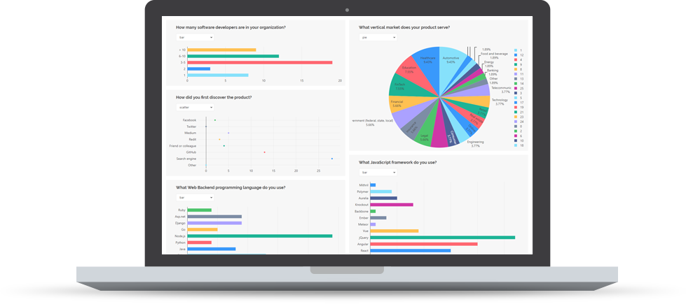

# SurveyJS Analytics

[](https://dev.azure.com/SurveyJS/SurveyJS%20Integration%20Tests/_build/latest?definitionId=7&branchName=master)
<a href="https://github.com/DevExpress/testcafe">

</a>
<a href="https://github.com/surveyjs/survey-analytics/issues">

</a>
<a href="https://github.com/surveyjs/survey-analytics/issues?utf8=%E2%9C%93&q=is%3Aissue+is%3Aclosed+">

</a>

SurveyJS Analytics visualizes survey results and allows users to analyze them.



## Features

- Supported chart types:
  - Bar
  - Pie
  - Line
  - Gauge
  - Bullet
  - Scatter
  - Word cloud
- Interactive filtering
- Customizable colors
- Dynamic layout
- Chart reordering via drag and drop

## Get Started

- [Angular](https://surveyjs.io/Documentation/Analytics?id=get-started-angular)
- [Vue](https://surveyjs.io/Documentation/Analytics?id=get-started-vue)
- [React](https://surveyjs.io/Documentation/Analytics?id=get-started-react)
- [Knockout / jQuery](https://surveyjs.io/Documentation/Analytics?id=get-started-knockout-jquery)

## Resources

- [Website](https://surveyjs.io/)
- [Documentation](https://surveyjs.io/Documentation/Analytics)
- [Live Examples](https://surveyjs.io/Examples/Analytics)
- [What's New](https://surveyjs.io/WhatsNew)

## Build SurveyJS Analytics from Sources

1. **Clone the repo**

    ```
    git clone https://github.com/surveyjs/survey-analytics.git
    cd survey-analytics
    ```

1. **Install dependencies**          
Make sure that you have Node.js v6.0.0 or later and npm v2.7.0 or later installed.

    ```
    npm install
    ```

1. **Build the library**

    ```
    npm run build:prod
    ```

    You can find the built scripts and style sheets in the `packages` folder.

1. **Run test examples**

    ```
    npm start
    ```

    This command runs a local HTTP server at http://localhost:8080/.

1. **Run unit tests**

    ```
    npm test
    ```

## Licensing

SurveyJS Analytics is **not available for free commercial usage**. If you want to integrate it into your application, you must purchase a [commercial license](/Licenses#SurveyCreator).
