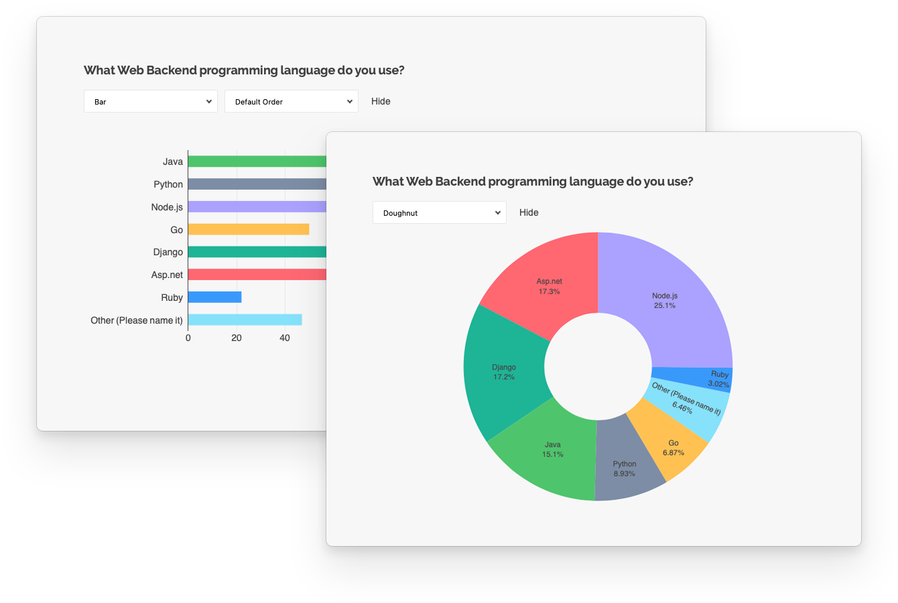

# SurveyJS Dashboard


<video src="https://github.com/surveyjs/survey-analytics/assets/22315929/2ebc84e1-dc43-4873-8c72-a1b4125e8749"></video>


[](https://dev.azure.com/SurveyJS/SurveyJS%20Integration%20Tests/_build/latest?definitionId=7&branchName=master)
<a href="https://github.com/DevExpress/testcafe">

</a>
<a href="https://github.com/surveyjs/survey-analytics/issues">

</a>
<a href="https://github.com/surveyjs/survey-analytics/issues?utf8=%E2%9C%93&q=is%3Aissue+is%3Aclosed+">

</a>

The SurveyJS Dashboard library lets you build survey data dashboards and simplify survey data analysis with interactive and customizable charts and tables. Visualize your insights and analyze survey results in one view.

## Features

- Supported chart and graph types:
  - Bar chart
  - Donut graph
  - Pie chart
  - Gauge chart
  - Bullet graph
  - Word cloud
- Interactive value filtering ordering
- Customizable colors
- Dynamic layout
- Drag-and-drop chart reordering



## Get Started

- [Angular](https://surveyjs.io/Documentation/Analytics?id=get-started-angular)
- [Vue](https://surveyjs.io/Documentation/Analytics?id=get-started-vue)
- [React](https://surveyjs.io/Documentation/Analytics?id=get-started-react)
- [HTML/CSS/JavaScript](https://surveyjs.io/dashboard/documentation/get-started-html-css-javascript)

## Resources

- [Website](https://surveyjs.io/)
- [Documentation](https://surveyjs.io/dashboard/documentation/overview)
- [Live Examples](https://surveyjs.io/dashboard/examples/)
- [What's New](https://surveyjs.io/stay-updated/major-updates/2024)

## Build SurveyJS Dashboard from Sources

1. **Clone the repo**

    ```
    git clone https://github.com/surveyjs/survey-analytics.git
    cd survey-analytics
    ```

1. **Install dependencies**          
Make sure that you have Node.js v6.0.0 or later and npm v2.7.0 or later installed.

    ```
    npm install
    ```

1. **Build the library**

    ```
    npm run build
    ```

    You can find the built scripts and style sheets in the `build` folder.

1. **Run test examples**

    ```
    npm start
    ```

    This command runs a local HTTP server at http://localhost:8080/.

1. **Run unit tests**

    ```
    npm test
    ```

## Licensing

SurveyJS Dashboard is **not available for free commercial usage**. If you want to integrate it into your application, you must purchase a [commercial license(s)](https://surveyjs.io/licensing) for software developer(s) who will be working with the SurveyJS product's APIs and implementing their integration.
