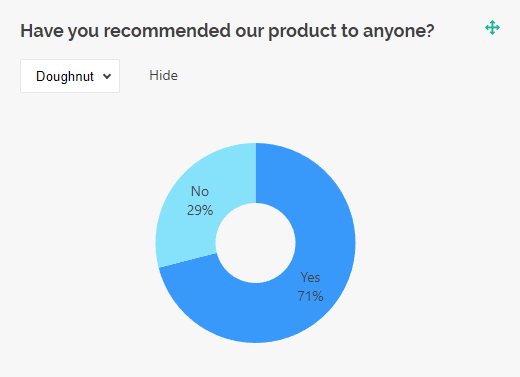

# Chart Types

SurveyJS Dashboard visualizes survey data using different types of charts. This help topic gives a brief overview of the chart types included in the library. Each description includes illustrations and a list of supported question types.

## Bar Chart

A bar chart visualizes categorical data with rectangular bars. The length of each bar is proportional to the value it represents. SurveyJS Dashboard supports vertical and horizontal bar charts.


Bar charts are supported by the question types listed below:

- [Radio Button Group](https://surveyjs.io/form-library/examples/single-select-radio-button-group/)
- [Checkboxes](https://surveyjs.io/form-library/examples/create-checkboxes-question-in-javascript/)
- [Dropdown](https://surveyjs.io/form-library/examples/create-dropdown-menu-in-javascript/)
- [Multi-Select Dropdown (Tag Box)](https://surveyjs.io/form-library/examples/how-to-create-multiselect-tag-box/)
- [Image Picker](https://surveyjs.io/form-library/examples/image-picker-question/)
- [Yes/No (Boolean)](https://surveyjs.io/form-library/examples/yes-no-question/)
- [Single-Select Matrix](https://surveyjs.io/form-library/examples/single-selection-matrix-table-question/)
- [Ranking](https://surveyjs.io/form-library/examples/add-ranking-question-to-form/)
- Any of these question types used within a [Multi-Select Matrix](https://surveyjs.io/form-library/examples/multi-select-matrix-question/), [Dynamic Matrix](https://surveyjs.io/form-library/examples/dynamic-matrix-add-new-rows/), or [Dynamic Panel](https://surveyjs.io/form-library/examples/duplicate-group-of-fields-in-form/)

[View Demo](https://surveyjs.io/dashboard/examples/interactive-survey-data-dashboard/ (linkStyle))

## Pie Chart

A pie chart is a circular graph divided into slices that represent proportions of a whole. Pie charts are great for visualizing how each category contributes to a total. They work best with fewer categories because a bigger number of slices can make chart interpretation difficult.


Pie charts are supported by the following question types:

- [Radio Button Group](https://surveyjs.io/form-library/examples/single-select-radio-button-group/)
- [Checkboxes](https://surveyjs.io/form-library/examples/create-checkboxes-question-in-javascript/)
- [Dropdown](https://surveyjs.io/form-library/examples/create-dropdown-menu-in-javascript/)
- [Multi-Select Dropdown (Tag Box)](https://surveyjs.io/form-library/examples/how-to-create-multiselect-tag-box/)
- [Image Picker](https://surveyjs.io/form-library/examples/image-picker-question/)
- [Yes/No (Boolean)](https://surveyjs.io/form-library/examples/yes-no-question/)
- [Ranking](https://surveyjs.io/form-library/examples/add-ranking-question-to-form/)
- Any of these question types used within a [Multi-Select Matrix](https://surveyjs.io/form-library/examples/multi-select-matrix-question/), [Dynamic Matrix](https://surveyjs.io/form-library/examples/dynamic-matrix-add-new-rows/), or [Dynamic Panel](https://surveyjs.io/form-library/examples/duplicate-group-of-fields-in-form/)

## Doughnut Chart

A doughnut chart is a pie chart but with a blank center. This shape may help reduce visual clutter and draw viewer's attention to the length of the arc rather than the area of the slices.



Doughnut charts are supported by the following question types:

- [Radio Button Group](https://surveyjs.io/form-library/examples/single-select-radio-button-group/)
- [Checkboxes](https://surveyjs.io/form-library/examples/create-checkboxes-question-in-javascript/)
- [Dropdown](https://surveyjs.io/form-library/examples/create-dropdown-menu-in-javascript/)
- [Multi-Select Dropdown (Tag Box)](https://surveyjs.io/form-library/examples/how-to-create-multiselect-tag-box/)
- [Image Picker](https://surveyjs.io/form-library/examples/image-picker-question/)
- [Yes/No (Boolean)](https://surveyjs.io/form-library/examples/yes-no-question/)
- [Ranking](https://surveyjs.io/form-library/examples/add-ranking-question-to-form/)
- Any of these question types used within a [Multi-Select Matrix](https://surveyjs.io/form-library/examples/multi-select-matrix-question/), [Dynamic Matrix](https://surveyjs.io/form-library/examples/dynamic-matrix-add-new-rows/), or [Dynamic Panel](https://surveyjs.io/form-library/examples/duplicate-group-of-fields-in-form/)

## Histogram

A histogram is a chart type that visualizes the distribution of a dataset. It divides a continuous data range into intervals and shows how many data points fall within each interval. Histograms support both vertical and horizontal views.  


Histograms are supported by the following question types:

- [Single-Line Input](https://surveyjs.io/form-library/examples/numeric-entry-question/) with [`inputType`](https://surveyjs.io/form-library/documentation/api-reference/text-entry-question-model#inputType) set to `"number"`, `"date"`, or `"datetime"`
- [Rating Scale](https://surveyjs.io/form-library/examples/rating-scale/)
- Any of these question types used within a [Multi-Select Matrix](https://surveyjs.io/form-library/examples/multi-select-matrix-question/), [Dynamic Matrix](https://surveyjs.io/form-library/examples/dynamic-matrix-add-new-rows/), or [Dynamic Panel](https://surveyjs.io/form-library/examples/duplicate-group-of-fields-in-form/)

[View Demo](https://surveyjs.io/dashboard/examples/interactive-survey-data-dashboard/ (linkStyle))

## Gauge Chart

A gauge chart is used to display a single numeric value, which is the average of a given dataset. The gauge chart takes the form of a semicircle with scale marks along the arc. Inside the arc is a needle or bar indicating the value.


Gauge charts are supported by the following question types:

- [Single-Line Input](https://surveyjs.io/form-library/examples/numeric-entry-question/) with [`inputType`](https://surveyjs.io/form-library/documentation/api-reference/text-entry-question-model#inputType) set to `"number"`
- [Rating Scale](https://surveyjs.io/form-library/examples/rating-scale/)
- [Expression](https://surveyjs.io/form-library/examples/expression-question-for-dynamic-form-calculations/)
- Any of these question types used within a [Multi-Select Matrix](https://surveyjs.io/form-library/examples/multi-select-matrix-question/), [Dynamic Matrix](https://surveyjs.io/form-library/examples/dynamic-matrix-add-new-rows/), or [Dynamic Panel](https://surveyjs.io/form-library/examples/duplicate-group-of-fields-in-form/)

[View Demo](https://surveyjs.io/dashboard/examples/how-to-customize-plotly-gauge-chart-javascript/ (linkStyle))

## Bullet Chart

A bullet chart visualizes a single number on a horizontal strip. Similar to a gauge, it displays the average of a dataset, with the value indicated by a bar. The strip displays scale marks along its length, similar to the scale on a gauge's semicircle.


Bullet charts are supported by the following question types:

- [Single-Line Input](https://surveyjs.io/form-library/examples/numeric-entry-question/) with [`inputType`](https://surveyjs.io/form-library/documentation/api-reference/text-entry-question-model#inputType) set to `"number"`
- [Rating Scale](https://surveyjs.io/form-library/examples/rating-scale/)
- [Expression](https://surveyjs.io/form-library/examples/expression-question-for-dynamic-form-calculations/)
- Any of these question types used within a [Multi-Select Matrix](https://surveyjs.io/form-library/examples/multi-select-matrix-question/), [Dynamic Matrix](https://surveyjs.io/form-library/examples/dynamic-matrix-add-new-rows/), or [Dynamic Panel](https://surveyjs.io/form-library/examples/duplicate-group-of-fields-in-form/)

## Radar Chart / Spider Chart

A radar chart, also known as "spider chart" or "web chart", displays multivariate data as a two-dimensional chart in which multiple axes are arranged in a circle and radiate from the same central point. Each data point is plotted on its corresponding axis, and the points are connected to form a polygon. Radar charts provide a quick and intuitive way to compare values across different variables, making it easy to identify strengths and weaknesses at a glance.


Radar charts are supported by the following question types:

- [Ranking](https://surveyjs.io/form-library/examples/add-ranking-question-to-form/)

[View Demo](/dashboard/examples/radar-chart/ (linkStyle))

## Stacked Bar Chart

A stacked bar chart displays each bar divided into multiple segments that visualize the percentage contribution of each category. The total length of bars represents 100%. Stacked bar charts are useful for showing the breakdown of a total into its individual components.


Stacked bar charts are supported by the following question types:

- [Single-Select Matrix](https://surveyjs.io/form-library/examples/single-selection-matrix-table-question/)

## Word Cloud

A word cloud (also "text cloud" or "tag cloud") visualizes textual data by adjusting the size of words based on their frequency. Word clouds are useful for analyzing large collections of textual data as they provide an immediate and illustrative summary of it.


Word clouds are supported by the following question types:

- [Single-Line Input](https://surveyjs.io/form-library/examples/text-entry-question/)
- [Long Text](https://surveyjs.io/form-library/examples/add-open-ended-question-to-a-form/)
- [Multiple Textboxes](https://surveyjs.io/form-library/examples/multiple-text-box-question/)
- Any of these question types used within a [Multi-Select Matrix](https://surveyjs.io/form-library/examples/multi-select-matrix-question/), [Dynamic Matrix](https://surveyjs.io/form-library/examples/dynamic-matrix-add-new-rows/), or [Dynamic Panel](https://surveyjs.io/form-library/examples/duplicate-group-of-fields-in-form/)

## Text Table

A text table is a visualization type that displays textual data in a simple table, without applying any data aggregation.


Text tables are supported by the following question types:

- [Single-Line Input](https://surveyjs.io/form-library/examples/text-entry-question/)
- [Long Text](https://surveyjs.io/form-library/examples/add-open-ended-question-to-a-form/)
- [Multiple Textboxes](https://surveyjs.io/form-library/examples/multiple-text-box-question/)
- Any of these question types used within a [Multi-Select Matrix](https://surveyjs.io/form-library/examples/multi-select-matrix-question/), [Dynamic Matrix](https://surveyjs.io/form-library/examples/dynamic-matrix-add-new-rows/), or [Dynamic Panel](https://surveyjs.io/form-library/examples/duplicate-group-of-fields-in-form/)

## Statistics Table

A statistics table is a visualization type that aggregates data from single- and multi-select questions and displays it in a tabular format.


Statistics tables are supported by the following question types:

- [Radio Button Group](https://surveyjs.io/form-library/examples/single-select-radio-button-group/)
- [Checkboxes](https://surveyjs.io/form-library/examples/create-checkboxes-question-in-javascript/)
- [Dropdown](https://surveyjs.io/form-library/examples/create-dropdown-menu-in-javascript/)

## NPS Visualizer

An NPS visualizer is a chart designed specifically for Net Promoter Score (NPS) questions. NPS measures customer loyalty and identifies business growth opportunities. Respondents rate how likely they are to recommend your product or service on a scale from 0 to 10.

- Promoters (score 9-10) are most likely keep buying your product and bring new customers. 
- Passives (score 7-8) are overall satisfied with your product but may switch to your competitors if they come across a more attractive offering. 
- Detractors (score 0-6) are unhappy with your product and may damage your brand through negative word-of-mouth. 

To calculate the NPS, the percentage of detractors should be subtracted from that of promoters.


The NPS visualizer is supported only by [Rating Scale](https://surveyjs.io/form-library/examples/rating-scale/) questions, standalone or used within a [Multi-Select Matrix](https://surveyjs.io/form-library/examples/multi-select-matrix-question/), [Dynamic Matrix](https://surveyjs.io/form-library/examples/dynamic-matrix-add-new-rows/), or [Dynamic Panel](https://surveyjs.io/form-library/examples/duplicate-group-of-fields-in-form/). This visualizer is disabled by default. To enable it, use the following code:

```js
import { VisualizationManager, NpsVisualizer } from "survey-analytics";

VisualizationManager.registerVisualizer("rating", NpsVisualizer);
```

[View Demo](https://surveyjs.io/dashboard/examples/how-to-visualize-net-promoter-score-results/ (linkStyle))


<!--

## Chart Types vs Question Types

|                    | Bar | Histogram | Pie | Doughnut | Gauge | Bullet | Stacked Bar | Word Cloud | Table | NPS | Line |
| ------------------ | --- | --------- | --- | -------- | ----- | ------ | ----------- | ---------- | ----- | --- | ---- |
| Radio Button Group | <span class="yes-mark"/> |  | <span class="yes-mark"/> | <span class="yes-mark"/> |  |  |  |  |  |  |  |
| Checkboxes | <span class="yes-mark"/> |  | <span class="yes-mark"/> | <span class="yes-mark"/> |  |  |  |  |  |  |  |
| Dropdown | <span class="yes-mark"/> |  | <span class="yes-mark"/> | <span class="yes-mark"/> |  |  |  |  |  |  |  |
| Multi-Select Dropdown (Tag Box) | <span class="yes-mark"/> |  | <span class="yes-mark"/> | <span class="yes-mark"/> |  |  |  |  |  |  |  |
| Image Picker | <span class="yes-mark"/> |  | <span class="yes-mark"/> | <span class="yes-mark"/> |  |  |  |  |  |  |  |
| Yes/No (Boolean) | <span class="yes-mark"/> |  | <span class="yes-mark"/> | <span class="yes-mark"/> |  |  |  |  |  |  |  |
| Single-Select Matrix | <span class="yes-mark"/> |  |  |  |  |  | <span class="yes-mark"/> |  |  |  |  |
| Ranking | <span class="yes-mark"/> |  | <span class="yes-mark"/> | <span class="yes-mark"/> |  |  |  |  |  |  |  |
| Numeric Input |  | <span class="yes-mark"/> |  |  | <span class="yes-mark"/> | <span class="yes-mark"/> |  |  |  |  |  |
| Date-Time Input |  | <span class="yes-mark"/> |  |  |  |  |  |  |  |  |  |
| Text Input |  |  |  |  |  |  |  | <span class="yes-mark"/> | <span class="yes-mark"/> |  |  |
| Long Text |  |  |  |  |  |  |  | <span class="yes-mark"/> | <span class="yes-mark"/> |  |  |
| Multiple Textboxes |  |  |  |  |  |  |  | <span class="yes-mark"/> | <span class="yes-mark"/> |  |  |
| Rating Scale |  | <span class="yes-mark"/> |  |  | <span class="yes-mark"/> | <span class="yes-mark"/> |  |  |  | <span class="yes-mark"/> |  |
| Expression |  |  |  |  | <span class="yes-mark"/> | <span class="yes-mark"/> |  |  |  |  |  |

-->
