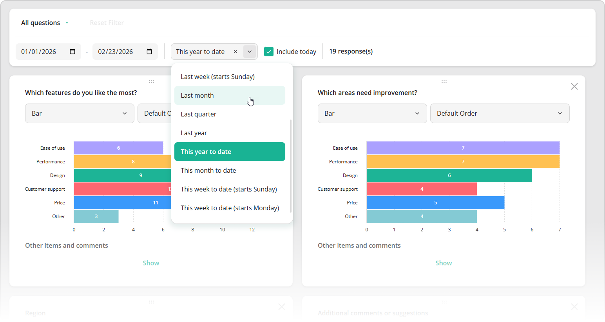

# Filter Dashboard Data by Date

SurveyJS Dashboard allows you to filter dashboard data by date using a dedicated date panel. This panel includes the following UI elements:

- Date editors for selecting the start and end dates of a custom range
- A drop-down list with date range presets ("Last 7 days", "Last month", "This year to date", etc.)
- A checkbox that includes or excludes the current day for relative periods (for example, "This year to date")
- A counter that displays the number of responses matching the applied filter



This topic explains how to enable date filtering, customize the list of date range presets, handle date range changes, and apply a fixed (non-editable) date filter.

## Enable Date Filtering

Date filtering requires a timestamp field in your response data. Assign the name of this field to the Dashboard's [`dateFieldName`](/dashboard/documentation/api-reference/idashboardoptions#dateFieldName) option. When this option is specified, the date panel is displayed automatically.

```js
import { Dashboard } from "survey-analytics";

const dashboardOptions = {
  questions: [ /* ... */ ],
  data: [
    {
      // ...
      timestamp: "2026-02-22T13:40:34.954Z"
    },
    {
      // ...
      timestamp: "2026-02-23T09:23:41.512Z"
    },
    // ...
  ],
  dateFieldName: "timestamp"
};
const dashboard = new Dashboard(dashboardOptions);
```

[View Demo](/dashboard/examples/employee-engagement-survey-analysis/ (linkStyle))

## Configure Date Range Presets

Date range presets allow users to select a date range without manually specifying start and end dates. SurveyJS Dashboard supports the following period identifiers:

- `"last7days"` &ndash; Last 7 days
- `"last14days"` &ndash; Last 14 days
- `"last28days"` &ndash; Last 28 days
- `"last30days"` &ndash; Last 30 days
- `"lastWeekSun"` &ndash; Last week (starts Sunday)
- `"lastWeekMon"` &ndash; Last week (starts Monday)
- `"lastMonth"` &ndash; Last month
- `"lastQuarter"` &ndash; Last quarter
- `"lastYear"` &ndash; Last year
- `"ytd"` &ndash; This year to date
- `"mtd"` &ndash; This month to date
- `"wtdSun"` &ndash; This week to date (starts Sunday)
- `"wtdMon"` &ndash; This week to date (starts Monday)
- `"qtd"` &ndash; This quarter to date

To restrict the list of available periods, specify the allowed identifiers in the [`availableDatePeriods`](/dashboard/documentation/api-reference/idashboardoptions#availableDatePeriods) array.

To define an initial period or retrieve the currently selected one, use the [`datePeriod`](/dashboard/documentation/api-reference/idashboardoptions#datePeriod) property. The example below sets "Last 30 days" as the initial period:

```js
import { Dashboard } from "survey-analytics";

const dashboardOptions = {
  questions: [ /* ... */ ],
  data: [ /* ... */ ],
  dateFieldName: "timestamp",
  datePeriod: "last30days"
};
const dashboard = new Dashboard(dashboardOptions);
```

[View Demo](/dashboard/examples/customer-satisfaction-survey-analysis/ (linkStyle))

## Handle Date Range Changes

To react to changes in the selected date range, use the [`onDateRangeChanged`](/dashboard/documentation/api-reference/dashboard#onDateRangeChanged) event. This event is raised when users select one of the predefined periods or define a custom date range.

The event handler receives an `options` object. The `options.dateRange` property contains an array in the format `[startDate, endDate]` and is always defined. The `options.datePeriod` property contains the identifier of the selected predefined period. If users specify a custom date range, `options.datePeriod` is `undefined`.

```js
import { Dashboard } from "survey-analytics";

const dashboardOptions = {
  // ...
};
const dashboard = new Dashboard(dashboardOptions);
dashboard.onDateRangeChanged.add((_, options) => {
  const dateRange = options.dateRange; // [ startDate, endDate ]
  const datePeriod = options.datePeriod; // undefined for custom ranges
  // ...
  // Custom logic here
  // ...
});
```

## Apply a Fixed Date Filter

You can apply a date range preset or custom date range and prevent users from modifying it. To do this, specify either the [`datePeriod`](/dashboard/documentation/api-reference/idashboardoptions#datePeriod) or [`dateRange`](/dashboard/documentation/api-reference/idashboardoptions#dateRange) option and set the [`showDatePanel`](/dashboard/documentation/api-reference/idashboardoptions#showDatePanel) option to `false`:

```js
import { Dashboard } from "survey-analytics";

const dashboardOptions = {
  questions: [ /* ... */ ],
  data: [ /* ... */ ],
  dateFieldName: "timestamp",

  // Option 1: Predefined period
  datePeriod: "last7days",

  // Option 2: Custom range
  // dateRange: ["2026-02-01", "2026-02-10"],

  showDatePanel: false
};
const dashboard = new Dashboard(dashboardOptions);
```

This configuration applies the specified date filter and hides the date panel, making the filter impossible to edit for dashboard users.

## Other Interactive UI Features

- [Cross-Filtering](/dashboard/documentation/cross-filtering)
- [Sorting](/dashboard/documentation/sorting)
- [Visualization Type Selection](/dashboard/documentation/visualization-type-selection)
- [Legend-Based Series Toggling](/dashboard/documentation/legend-based-series-toggling)
- [Dynamic Layout Management](/dashboard/documentation/dynamic-layout-management)