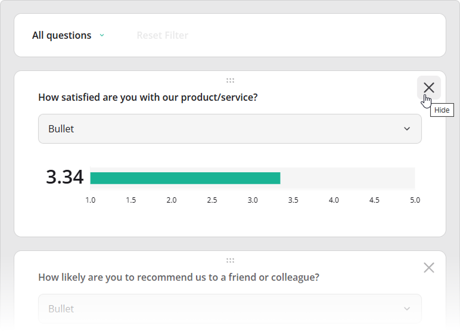
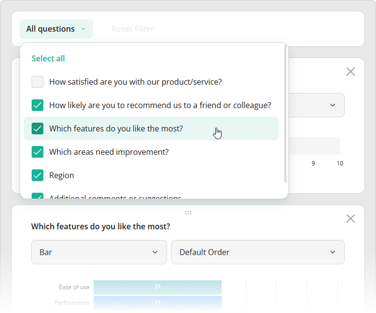
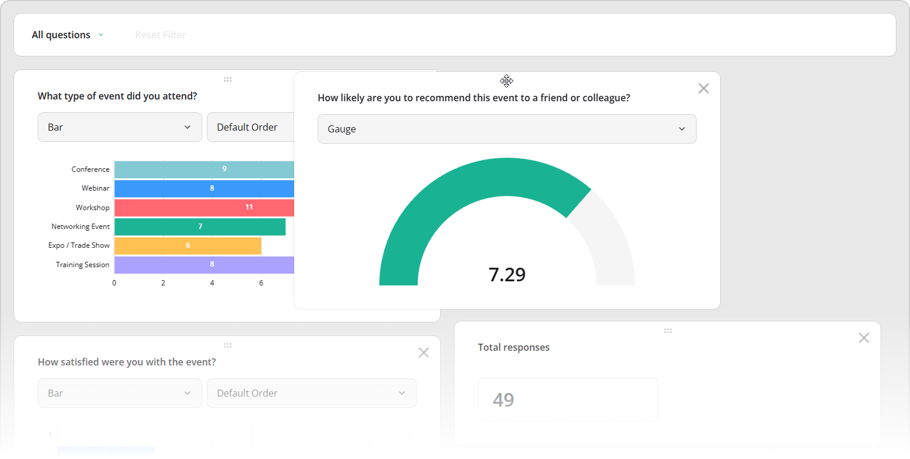

# Dynamic Layout Management in SurveyJS Dashboard

Dynamic layout management is an interactive feature that automatically arranges dashboard items and allows users to customize the layout by showing or hiding items and repositioning them via drag-and-drop.

## Supported Visualization Types

Dynamic layout management is available for [all visualization types](/dashboard/documentation/chart-types).

## Show and Hide Items

To hide a dashboard item, click the **X** button in its top-right corner.



All items&mdash;both visible and hidden&mdash;are listed in the **All questions** drop-down menu in the toolbar. Use this menu to control visibility by selecting or clearing individual checkboxes, or by clicking **Select all** or **Clear selection**.



[View Demo](/dashboard/examples/customer-satisfaction-survey-analysis/ (linkStyle))

In code, item visibility is controlled by the [`visible`](/dashboard/documentation/api-reference/idashboarditemoptions#visible) property. You can define it when configuring the [`items`](/dashboard/documentation/api-reference/idashboardoptions#items) array or update it at runtime via the [`getItem()`](/dashboard/documentation/api-reference/dashboard#getItem) method:

```js
import { Dashboard } from "survey-analytics";

const dashboard = new Dashboard({
  questions: [ /* Survey questions to visualize */ ],
  data: [ /* Survey responses to aggregate */ ],
  items: [
    {
      name: "question1",
      visible: false
    },
    // ...
  ]
});

dashboard.getItem("question1").visible = true;
```

To prevent users from changing item visibility at runtime, set the [`allowHideQuestions`](/dashboard/documentation/api-reference/idashboardoptions#allowHideQuestions) property to `false`:

```js
import { Dashboard } from "survey-analytics";

const dashboard = new Dashboard({
  questions: [ /* ... */ ],
  data: [ /* ... */ ],
  items: [ /* ... */ ],
  allowHideQuestions: false // Disables visibility changes
});
```

## Reorder Items (Drag and Drop)

To reposition a dashboard item, drag it using the handle located at its center.



[View Demo](/dashboard/examples/event-feedback-survey-analysis/ (linkStyle))

In code, you can control item order by arranging entries in the [`items`](/dashboard/documentation/api-reference/idashboardoptions#items) array. Items are laid out row by row (not column by column), so their order in the array determines their placement:

```js
import { Dashboard } from "survey-analytics";

const dashboard = new Dashboard({
  questions: [ /* ... */ ],
  data: [ /* ... */ ],
  items: [
    "question1", "question2",
    "question3", "question4",
    "question5", "question6",
    // ...
  ]
});
```

## Other Interactive UI Features

- [Date Range Filtering](/dashboard/documentation/date-range-filtering)
- [Cross-Filtering](/dashboard/documentation/cross-filtering)
- [Sorting](/dashboard/documentation/sorting)
- [Visualization Type Selection](/dashboard/documentation/visualization-type-selection)
- [Legend-Based Series Toggling](/dashboard/documentation/legend-based-series-toggling)