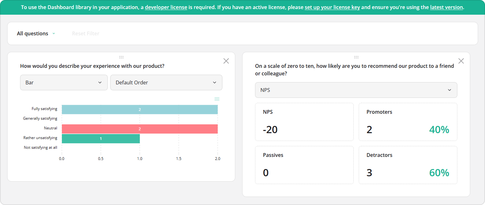

# Add SurveyJS Dashboard to an Angular Application

This tutorial explains how to integrate SurveyJS Dashboard into an Angular application and visualize survey results. Follow the steps below to set up and render a dashboard:

- [Install the `survey-analytics` npm Package](#install-the-survey-analytics-npm-package)
- [Configure Styles](#configure-styles)
- [Load Survey Results](#load-survey-results)
- [Configure the Dashboard](#configure-the-dashboard)
- [Render the Dashboard](#render-the-dashboard)
- [Activate a SurveyJS License](#activate-a-surveyjs-license)

The final result is an interactive dashboard similar to the one shown below:

<details>
  <summary>View Live Example</summary>

<iframe src="/proxy/github/code-examples/get-started-analytics/html-css-js/index.html"
    style="width:100%; border:0; border-radius: 4px; overflow:hidden;"
></iframe>

</details>

[View Full Code on GitHub](https://github.com/surveyjs/code-examples/tree/main/get-started-analytics/angular (linkStyle))

If you need a preconfigured starter project with all SurveyJS components, refer to the following repository: <a href="https://github.com/surveyjs/surveyjs_angular_cli" target="_blank">SurveyJS + Angular CLI Quickstart Template</a>.

## Install the `survey-analytics` npm Package

SurveyJS Dashboard is distributed as the <a href="https://www.npmjs.com/package/survey-analytics" target="_blank">survey-analytics</a> npm package. Install it using the following command:

```sh
npm install survey-analytics
```

SurveyJS Dashboard uses the <a href="https://www.chartjs.org/" target="_blank">Chart.js</a> library for data visualization. This dependency is installed automatically.

## Configure Styles

Open the `angular.json` file and add the SurveyJS Dashboard stylesheet to the `styles` array:

```js
"styles": [
  "src/styles.css",
  "node_modules/survey-analytics/survey.analytics.min.css"
]
```

## Load Survey Results

When a respondent completes a survey, a JSON object with their answers is passed to the `SurveyModel`'s [`onComplete`](https://surveyjs.io/form-library/documentation/api-reference/survey-data-model#onComplete) event handler. Send this object to your server and store it with a specific survey ID (see [Handle Survey Completion](/form-library/documentation/get-started-angular#handle-survey-completion)). A collection of these JSON objects forms the data source for the Dashboard. You can aggregate this data either on the server or on the client.

### Server-Side Data Processing

By default, the Dashboard loads all stored responses and processes them in the browser, which can degrade performance as the dataset grows. To optimize load times, move aggregation logic to the server and return only precomputed statistics to the client. See the following demo for a reference implementation:

[SurveyJS Dashboard: Server-Side Data Processing Demo Example](https://github.com/surveyjs/surveyjs-dashboard-nodejs-mongodb (linkStyle))

### Client-Side Data Processing

With client-side processing, the Dashboard loads the full dataset at startup and performs aggregation in the browser. This approach requires more bandwidth and client-side resources, but is sufficient and often simpler for smaller datasets.

To retrieve results, send a request to your backend and return an array of JSON objects:

```js
import { AfterViewInit, Component } from '@angular/core';

const SURVEY_ID = 1;

@Component({
  // ...
})
export class AppComponent implements AfterViewInit {
  // ...
  async ngAfterViewInit(): Promise<void> {
    try {
      const surveyResults = await loadSurveyResults(
        `https://your-web-service.com/${SURVEY_ID}`
      );

      // ...
      // Configure and render the Dashboard here
      // Refer to the section below
      // ...
    } catch (error) {
      console.error('Failed to load survey results:', error);
    }
  }
}

function loadSurveyResults(url: string): Promise<any[]> {
  return fetch(url, {
    method: 'GET',
    headers: {
      'Content-Type': 'application/x-www-form-urlencoded'
    }
  })
    .then((response) => {
      if (!response.ok) {
        throw new Error(`Request failed with status ${response.status}`);
      }
      return response.json();
    })
    .catch((error) => {
      throw new Error(error.message || 'Network error');
    });
}
```

For demonstration purposes, this tutorial uses predefined survey results:

```js
const surveyJson = {
  elements: [{
    name: "satisfaction-score",
    title: "How would you describe your experience with our product?",
    type: "radiogroup",
    choices: [
      { value: 5, text: "Fully satisfying" },
      { value: 4, text: "Generally satisfying" },
      { value: 3, text: "Neutral" },
      { value: 2, text: "Rather unsatisfying" },
      { value: 1, text: "Not satisfying at all" }
    ],
    isRequired: true
  }, {
    name: "nps-score",
    title: "On a scale of zero to ten, how likely are you to recommend our product to a friend or colleague?",
    type: "rating",
    rateMin: 0,
    rateMax: 10,
  }],
  completedHtml: "Thank you for your feedback!",
};

const surveyResults = [
  { "satisfaction-score": 5, "nps-score": 10 },
  { "satisfaction-score": 5, "nps-score": 9 },
  { "satisfaction-score": 3, "nps-score": 6 },
  { "satisfaction-score": 3, "nps-score": 6 },
  { "satisfaction-score": 2, "nps-score": 3 }
];
```

<div id="configure-the-visualization-panel"></div>

## Configure the Dashboard

Pass an [`IDashboardOptions`](/dashboard/documentation/api-reference/idashboardoptions) object to the [`Dashboard`](/dashboard/documentation/api-reference/dashboard) constructor to configure the dashboard.

Specify the [`data`](/dashboard/documentation/api-reference/idashboardoptions#data) array to provide survey results. You can then either auto-generate dashboard items based on survey questions or define them manually.

### Auto-Generate Dashboard Items

To generate dashboard items automatically, assign survey questions to the [`questions`](/dashboard/documentation/api-reference/idashboardoptions#questions) property. Use the [`SurveyModel`](https://surveyjs.io/form-library/documentation/api-reference/survey-data-model)'s [`getAllQuestions()`](https://surveyjs.io/form-library/documentation/api-reference/survey-data-model#getAllQuestions) method to retrieve them.

Each generated item inherits the question's [`name`](/dashboard/documentation/api-reference/idashboarditemoptions#name) and [`title`](/dashboard/documentation/api-reference/idashboarditemoptions#title). The Dashboard also automatically selects a suitable visualization [`type`](/dashboard/documentation/api-reference/idashboarditemoptions#type) and populates the list of available alternative types ([`availableTypes`](/dashboard/documentation/api-reference/idashboarditemoptions#availableTypes)) that users can switch between.

Use the [`items`](/dashboard/documentation/api-reference/idashboardoptions#items) array to control which items appear and override their configuration. This array can include question names and [full configuration objects](/dashboard/documentation/api-reference/idashboarditemoptions). When you specify a configuration object, it is merged with the auto-generated settings.

The following example uses the `items` array to set the default [NPS visualization](https://surveyjs.io/dashboard/documentation/chart-types#nps-visualizer) type for the `nps-score` question:

```js
import { AfterViewInit, Component } from '@angular/core';
import { Model } from 'survey-core';
import { Dashboard } from 'survey-analytics';

const surveyJson = { /* ... */ };
const surveyResults = [ /* ... */ ];

@Component({
  // ...
})
export class AppComponent implements AfterViewInit {
  ngAfterViewInit(): void {
    const survey = new Model(surveyJson);
    const dashboard = new Dashboard({
      questions: survey.getAllQuestions(),
      data: surveyResults,
      items: [
        "satisfaction-score",
        {
          name: "nps-score",
          type: "nps"
        }
      ]
    });
  }
}
```

<details>
    <summary>View Full Code</summary>

```js
import { AfterViewInit, Component } from '@angular/core';
import { Model } from 'survey-core';
import { Dashboard } from 'survey-analytics';

const surveyJson = {
  elements: [{
    name: "satisfaction-score",
    title: "How would you describe your experience with our product?",
    type: "radiogroup",
    choices: [
      { value: 5, text: "Fully satisfying" },
      { value: 4, text: "Generally satisfying" },
      { value: 3, text: "Neutral" },
      { value: 2, text: "Rather unsatisfying" },
      { value: 1, text: "Not satisfying at all" }
    ],
    isRequired: true
  }, {
    name: "nps-score",
    title: "On a scale of zero to ten, how likely are you to recommend our product to a friend or colleague?",
    type: "rating",
    rateMin: 0,
    rateMax: 10,
  }],
  completedHtml: "Thank you for your feedback!",
};

const surveyResults = [
  { "satisfaction-score": 5, "nps-score": 10 },
  { "satisfaction-score": 5, "nps-score": 9 },
  { "satisfaction-score": 3, "nps-score": 6 },
  { "satisfaction-score": 3, "nps-score": 6 },
  { "satisfaction-score": 2, "nps-score": 3 }
];

@Component({
  selector: 'app-root',
  templateUrl: './app.component.html',
  styleUrls: ['./app.component.css']
})
export class AppComponent implements AfterViewInit {
  title = 'SurveyJS Dashboard for Angular';

  ngAfterViewInit(): void {
    const survey = new Model(surveyJson);
    const dashboard = new Dashboard({
      questions: survey.getAllQuestions(),
      data: surveyResults,
      items: [
        "satisfaction-score",
        {
          name: "nps-score",
          type: "nps"
        }
      ]
    });
  }
}
```

</details>

### Configure Dashboard Items Manually

If your dashboard is not based on a survey schema, configure all items explicitly. Populate the [`items`](/dashboard/documentation/api-reference/idashboardoptions#items) array with [`IDashboardItemOptions`](/dashboard/documentation/api-reference/idashboarditemoptions) objects. Use the [`name`](/dashboard/documentation/api-reference/idashboarditemoptions#name) property to bind each item to a data field.

```js
import { AfterViewInit, Component } from '@angular/core';
import { Dashboard } from 'survey-analytics';

const surveyResults = [ /* ... */ ];

@Component({
  // ...
})
export class AppComponent implements AfterViewInit {
  ngAfterViewInit(): void {
    const dashboard = new Dashboard({
      data: surveyResults,
      items: [
        {
          name: "satisfaction-score",
          type: "bar",
          title: "CSAT",
          availableTypes: [ "bar", "vbar", "pie", "gauge" ]
        },
        {
          name: "nps-score",
          type: "nps",
          title: "NPS Score",
          allowChangeType: false
        }
      ]
    });
  }
}
```

<details>
    <summary>View Full Code</summary>

```js
import { AfterViewInit, Component } from '@angular/core';
import { Dashboard } from 'survey-analytics';

const surveyResults = [
  { "satisfaction-score": 5, "nps-score": 10 },
  { "satisfaction-score": 5, "nps-score": 9 },
  { "satisfaction-score": 3, "nps-score": 6 },
  { "satisfaction-score": 3, "nps-score": 6 },
  { "satisfaction-score": 2, "nps-score": 3 }
];

@Component({
  selector: 'app-root',
  templateUrl: './app.component.html',
  styleUrls: ['./app.component.css']
})
export class AppComponent implements AfterViewInit {
  title = 'SurveyJS Dashboard for Angular';

  ngAfterViewInit(): void {
    const survey = new Model(surveyJson);
    const dashboard = new Dashboard({
      data: surveyResults,
      items: [
        {
          name: "satisfaction-score",
          type: "bar",
          title: "CSAT",
          availableTypes: [ "bar", "vbar", "pie", "gauge" ]
        },
        {
          name: "nps-score",
          type: "nps",
          title: "NPS Score",
          allowChangeType: false
        }
      ]
    });
  }
}
```

</details>

<div id="render-the-visualization-panel"></div>

## Render the Dashboard

Add a container element to the component template:

```html
<div id="dashboard"></div>
```

Call the [`render(containerId)`](/dashboard/documentation/api-reference/dashboard#render) method on the `Dashboard` instance you configured to mount the dashboard:

```js
// ...
@Component({
  // ...
})
export class AppComponent implements AfterViewInit {
  ngAfterViewInit(): void {
    // ...
    dashboard.render("dashboard");
  }
}
```

Run the application with `ng serve` and open [http://localhost:4200/](http://localhost:4200/) in your browser.

<details>
    <summary>View Full Code</summary>

```html
<div id="dashboard"></div>
```

```js
import { AfterViewInit, Component } from '@angular/core';
import { Model } from 'survey-core';
import { Dashboard } from 'survey-analytics';

const surveyJson = {
  elements: [{
    name: "satisfaction-score",
    title: "How would you describe your experience with our product?",
    type: "radiogroup",
    choices: [
      { value: 5, text: "Fully satisfying" },
      { value: 4, text: "Generally satisfying" },
      { value: 3, text: "Neutral" },
      { value: 2, text: "Rather unsatisfying" },
      { value: 1, text: "Not satisfying at all" }
    ],
    isRequired: true
  }, {
    name: "nps-score",
    title: "On a scale of zero to ten, how likely are you to recommend our product to a friend or colleague?",
    type: "rating",
    rateMin: 0,
    rateMax: 10,
  }],
  completedHtml: "Thank you for your feedback!",
};

const surveyResults = [
  { "satisfaction-score": 5, "nps-score": 10 },
  { "satisfaction-score": 5, "nps-score": 9 },
  { "satisfaction-score": 3, "nps-score": 6 },
  { "satisfaction-score": 3, "nps-score": 6 },
  { "satisfaction-score": 2, "nps-score": 3 }
];

@Component({
  selector: 'app-root',
  templateUrl: './app.component.html',
  styleUrls: ['./app.component.css']
})
export class AppComponent implements AfterViewInit {
  title = 'SurveyJS Dashboard for Angular';

  ngAfterViewInit(): void {
    const survey = new Model(surveyJson);
    const dashboard = new Dashboard({
      questions: survey.getAllQuestions(),
      data: surveyResults,
      items: [
        "satisfaction-score",
        {
          name: "nps-score",
          type: "nps"
        }
      ]
    });
    dashboard.render("dashboard");
  }
}
```
</details>

[View Full Code on GitHub](https://github.com/surveyjs/code-examples/tree/main/get-started-analytics/angular (linkStyle))

## Activate a SurveyJS License

SurveyJS Dashboard is not available for free commercial use. To integrate it into your application, you must purchase a [commercial license](https://surveyjs.io/licensing) for the software developer(s) who will be working with the Dashboard APIs and implementing the integration. If you use SurveyJS Dashboard without a license, an alert banner will appear at the top of the interface:



After purchasing a license, follow the steps below to activate it and remove the alert banner:

1. [Log in](https://surveyjs.io/login) to the SurveyJS website using your email address and password. If you've forgotten your password, [request a reset](https://surveyjs.io/reset-password) and check your inbox for the reset link.
2. Open the following page: [How to Remove the Alert Banner](https://surveyjs.io/remove-alert-banner). You can also access it by clicking **Set up your license key** in the alert banner itself.
3. Follow the instructions on that page.

Once you've completed the setup correctly, the alert banner will no longer appear.

## See Also

[Dashboard Demo Examples](/dashboard/examples/ (linkStyle))