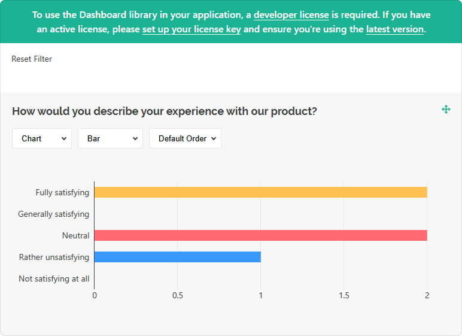

# Add SurveyJS Dashboard to a JavaScript Application

This step-by-step tutorial will help you get started with SurveyJS Dashboard in an application built with HTML, CSS, and JavaScript (without frontend frameworks). As a result, you will create a dashboard displayed below:

<iframe src="/proxy/github/code-examples/get-started-analytics/html-css-js/index.html"
    style="width:100%; border:0; border-radius: 4px; overflow:hidden;"
></iframe>

[View Full Code on GitHub](https://github.com/surveyjs/code-examples/tree/main/get-started-analytics/html-css-js (linkStyle))

## Link Resources

SurveyJS Dashboard depends on other JavaScript libraries. Reference them on your page in the following order:

1. Survey Core       
A platform-independent part of [SurveyJS Form Library](https://surveyjs.io/form-library/documentation/overview) that works with the survey model. SurveyJS Dashboard requires only this part, but if you also display the survey on the page, reference [the rest of the SurveyJS Form Library resources](/form-library/documentation/get-started-html-css-javascript#link-surveyjs-resources) as well.

1. <a href="https://github.com/plotly/plotly.js#readme" target="_blank">Plotly.js</a>       
A third-party library used to render charts.

1. SurveyJS Dashboard      
A library that integrates Survey Core with Plotly.js.

The following code shows how to reference these libraries:

```html
<head>
    <!-- ... -->
    <!-- SurveyJS Form Library resources -->
    <script type="text/javascript" src="https://unpkg.com/survey-core/survey.core.min.js"></script>
    <!-- Uncomment the following lines if you also display the survey on the page -->
    <!-- <link href="https://unpkg.com/survey-core/survey-core.min.css" type="text/css" rel="stylesheet"> -->
    <!-- <script type="text/javascript" src="https://unpkg.com/survey-js-ui/survey-js-ui.min.js"></script> -->

    <!-- Third-party data visualization library -->
    <script src="https://unpkg.com/plotly.js-dist-min/plotly.min.js"></script>

    <!-- SurveyJS Dashboard resources-->
    <link href="https://unpkg.com/survey-analytics/survey.analytics.min.css" rel="stylesheet">
    <script src="https://unpkg.com/survey-analytics/survey.analytics.min.js"></script>
</head>
```

## Load Survey Results

You can access survey results as a JSON object within the `SurveyModel`'s `onComplete` event handler. Send the results to your server and store them with a specific survey ID. Refer to the [Handle Survey Completion](/form-library/documentation/get-started-html-css-javascript#handle-survey-completion) help topic for more information.  

To load the survey results, send the survey ID to your server and return an array of JSON objects:

```js
const SURVEY_ID = 1;

loadSurveyResults("https://your-web-service.com/" + SURVEY_ID)
    .then((surveyResults) => {
        // ...
        // Configure and render the Visualization Panel here
        // Refer to the help topics below
        // ...
    });

function loadSurveyResults (url) {
    return new Promise((resolve, reject) => {
        const request = new XMLHttpRequest();
        request.open('GET', url);
        request.setRequestHeader('Content-Type', 'application/x-www-form-urlencoded');
        request.onload = () => {
            const response = request.response ? JSON.parse(request.response) : [];
            resolve(response);
        }
        request.onerror = () => {
            reject(request.statusText);
        }
        request.send();
    });
}
```

For demonstration purposes, this tutorial uses predefined survey results. The following code shows a survey model and the structure of the survey results array:

```js
const surveyJson = {
    elements: [{
        name: "satisfaction-score",
        title: "How would you describe your experience with our product?",
        type: "radiogroup",
        choices: [
            { value: 5, text: "Fully satisfying" },
            { value: 4, text: "Generally satisfying" },
            { value: 3, text: "Neutral" },
            { value: 2, text: "Rather unsatisfying" },
            { value: 1, text: "Not satisfying at all" }
        ],
        isRequired: true
    }, {
        name: "nps-score",
        title: "On a scale of zero to ten, how likely are you to recommend our product to a friend or colleague?",
        type: "rating",
        rateMin: 0,
        rateMax: 10,
    }],
    completedHtml: "Thank you for your feedback!",
};

const surveyResults = [{
    "satisfaction-score": 5,
    "nps-score": 10
}, {
    "satisfaction-score": 5,
    "nps-score": 9
}, {
    "satisfaction-score": 3,
    "nps-score": 6
}, {
    "satisfaction-score": 3,
    "nps-score": 6
}, {
    "satisfaction-score": 2,
    "nps-score": 3
}];
```

## Configure the Visualization Panel

Analytics charts are displayed in a Visualization Panel. Specify [its properties](/Documentation/Analytics?id=ivisualizationpaneloptions) in a configuration object. In this tutorial, the object enables the [`allowHideQuestions`](/Documentation/Analytics?id=ivisualizationpaneloptions#allowHideQuestions) property:

```js
const vizPanelOptions = {
    allowHideQuestions: false
}
```

Pass the configuration object, survey questions, and results to the `VisualizationPanel` constructor as shown in the code below to instantiate the Visualization Panel. Assign the produced instance to a constant that will be used later to render the component:

```js
const surveyJson = { /* ... */ };
const surveyResults = [ /* ... */ ];
const vizPanelOptions = { /* ... */ };

const survey = new Survey.Model(surveyJson);

const vizPanel = new SurveyAnalytics.VisualizationPanel(
    survey.getAllQuestions(),
    surveyResults,
    vizPanelOptions
);
```

<details>
    <summary>View Full Code</summary>

```html
<!DOCTYPE html>
<html>
<head>
    <title>SurveyJS Dashboard</title>
    <meta charset="utf-8">
    <script type="text/javascript" src="https://unpkg.com/survey-core/survey.core.min.js"></script>
    <!-- Uncomment the following lines if you also display the survey on the page -->
    <!-- <link href="https://unpkg.com/survey-core/survey-core.min.css" type="text/css" rel="stylesheet"> -->
    <!-- <script type="text/javascript" src="https://unpkg.com/survey-js-ui/survey-js-ui.min.js"></script> -->

    <script src="https://unpkg.com/plotly.js-dist-min/plotly.min.js"></script>

    <link href="https://unpkg.com/survey-analytics/survey.analytics.min.css" rel="stylesheet">
    <script src="https://unpkg.com/survey-analytics/survey.analytics.min.js"></script>

    <script type="text/javascript" src="index.js"></script>
</head>
<body>

</body>
</html>
```

```js
const surveyJson = {
    elements: [{
        name: "satisfaction-score",
        title: "How would you describe your experience with our product?",
        type: "radiogroup",
        choices: [
            { value: 5, text: "Fully satisfying" },
            { value: 4, text: "Generally satisfying" },
            { value: 3, text: "Neutral" },
            { value: 2, text: "Rather unsatisfying" },
            { value: 1, text: "Not satisfying at all" }
        ],
        isRequired: true
    }, {
        name: "nps-score",
        title: "On a scale of zero to ten, how likely are you to recommend our product to a friend or colleague?",
        type: "rating",
        rateMin: 0,
        rateMax: 10,
    }],
    completedHtml: "Thank you for your feedback!",
};

const survey = new Survey.Model(surveyJson);

const surveyResults = [{
    "satisfaction-score": 5,
    "nps-score": 10
}, {
    "satisfaction-score": 5,
    "nps-score": 9
}, {
    "satisfaction-score": 3,
    "nps-score": 6
}, {
    "satisfaction-score": 3,
    "nps-score": 6
}, {
    "satisfaction-score": 2,
    "nps-score": 3
}];

const vizPanelOptions = {
    allowHideQuestions: false
}

const vizPanel = new SurveyAnalytics.VisualizationPanel(
    survey.getAllQuestions(),
    surveyResults,
    vizPanelOptions
);
```
</details>

## Render the Visualization Panel

A Visualization Panel should be rendered in a page element. Add this element to the page markup:

```html
<body>
    <div id="surveyVizPanel"></div>
</body>
```

To render the Visualization Panel in the page element, call the `render(container)` method on the Visualization Panel instance you created in the previous step:

```js
document.addEventListener("DOMContentLoaded", function() {
    vizPanel.render(document.getElementById("surveyVizPanel"));
});
```

<details>
    <summary>View Full Code</summary>

```html
<!DOCTYPE html>
<html>
<head>
    <title>SurveyJS Dashboard</title>
    <meta charset="utf-8">
    <script type="text/javascript" src="https://unpkg.com/survey-core/survey.core.min.js"></script>
    <!-- Uncomment the following lines if you also display the survey on the page -->
    <!-- <link href="https://unpkg.com/survey-core/survey-core.min.css" type="text/css" rel="stylesheet"> -->
    <!-- <script type="text/javascript" src="https://unpkg.com/survey-js-ui/survey-js-ui.min.js"></script> -->

    <script src="https://unpkg.com/plotly.js-dist-min/plotly.min.js"></script>

    <link href="https://unpkg.com/survey-analytics/survey.analytics.min.css" rel="stylesheet">
    <script src="https://unpkg.com/survey-analytics/survey.analytics.min.js"></script>

    <script type="text/javascript" src="index.js"></script>
</head>
<body>
    <div id="surveyVizPanel"></div>
</body>
</html>
```

```js
const surveyJson = {
    elements: [{
        name: "satisfaction-score",
        title: "How would you describe your experience with our product?",
        type: "radiogroup",
        choices: [
            { value: 5, text: "Fully satisfying" },
            { value: 4, text: "Generally satisfying" },
            { value: 3, text: "Neutral" },
            { value: 2, text: "Rather unsatisfying" },
            { value: 1, text: "Not satisfying at all" }
        ],
        isRequired: true
    }, {
        name: "nps-score",
        title: "On a scale of zero to ten, how likely are you to recommend our product to a friend or colleague?",
        type: "rating",
        rateMin: 0,
        rateMax: 10,
    }],
    completedHtml: "Thank you for your feedback!",
};

const survey = new Survey.Model(surveyJson);

const surveyResults = [{
    "satisfaction-score": 5,
    "nps-score": 10
}, {
    "satisfaction-score": 5,
    "nps-score": 9
}, {
    "satisfaction-score": 3,
    "nps-score": 6
}, {
    "satisfaction-score": 3,
    "nps-score": 6
}, {
    "satisfaction-score": 2,
    "nps-score": 3
}];

const vizPanelOptions = {
    allowHideQuestions: false
}

const vizPanel = new SurveyAnalytics.VisualizationPanel(
    survey.getAllQuestions(),
    surveyResults,
    vizPanelOptions
);

document.addEventListener("DOMContentLoaded", function() {
    vizPanel.render(document.getElementById("surveyVizPanel"));
});
```
</details>

[View Full Code on GitHub](https://github.com/surveyjs/code-examples/tree/main/get-started-analytics/html-css-js (linkStyle))

## Activate a SurveyJS License

SurveyJS Dashboard is not available for free commercial use. To integrate it into your application, you must purchase a [commercial license](https://surveyjs.io/licensing) for the software developer(s) who will be working with the Dashboard APIs and implementing the integration. If you use SurveyJS Dashboard without a license, an alert banner will appear at the top of the interface:



After purchasing a license, follow the steps below to activate it and remove the alert banner:

1. [Log in](https://surveyjs.io/login) to the SurveyJS website using your email address and password. If you've forgotten your password, [request a reset](https://surveyjs.io/reset-password) and check your inbox for the reset link.
2. Open the following page: [How to Remove the Alert Banner](https://surveyjs.io/remove-alert-banner). You can also access it by clicking **Set up your license key** in the alert banner itself.
3. Follow the instructions on that page.

Once you've completed the setup correctly, the alert banner will no longer appear.

## See Also

[Dashboard Demo Examples](/dashboard/examples/ (linkStyle))