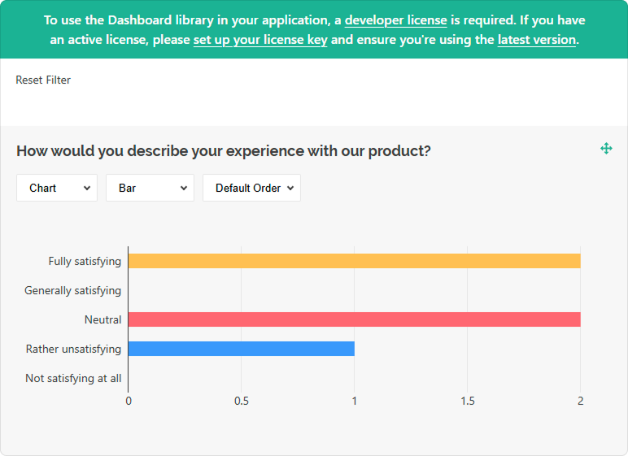

# Add SurveyJS Dashboard to a Vue Application

This step-by-step tutorial will help you get started with SurveyJS Dashboard in a Vue application. To add SurveyJS Dashboard to your application, follow the steps below:

- [Install the `survey-analytics` npm Package](#install-the-survey-analytics-npm-package)
- [Configure Styles](#configure-styles)
- [Load Survey Results](#load-survey-results)
- [Configure the Visualization Panel](#configure-the-visualization-panel)
- [Render the Visualization Panel](#render-the-visualization-panel)

As a result, you will create the following dashboard:

<iframe src="/proxy/github/code-examples/get-started-analytics/html-css-js/index.html"
    style="width:100%; border:0; border-radius: 4px; overflow:hidden;"
></iframe>

[View Full Code on GitHub](https://github.com/surveyjs/code-examples/tree/main/get-started-analytics/vue3 (linkStyle))

If you are looking for a quick-start application that includes all SurveyJS components, refer to the following GitHub repository: <a href="https://github.com/surveyjs/surveyjs_vue3_quickstart" target="_blank">SurveyJS + Vue 3 Quickstart Template</a>.

## Install the `survey-analytics` npm Package

SurveyJS Dashboard is distributed as a <a href="https://www.npmjs.com/package/survey-analytics" target="_blank">survey-analytics</a> npm package. Run the following command to install it:

```cmd
npm install survey-analytics --save
```

SurveyJS Dashboard depends on the <a href="https://github.com/plotly/plotly.js#readme" target="_blank">Plotly.js</a> library. The command above installs this library as a dependency.

## Configure Styles

Import the SurveyJS Dashboard style sheet as shown below:

```html
<script setup lang="ts">
import 'survey-analytics/survey.analytics.css'
</script>

<template>
  <!-- ... -->
</template>
```

## Load Survey Results

You can access survey results as a JSON object within the `SurveyModel`'s `onComplete` event handler. Send the results to your server and store them with a specific survey ID. Refer to the [Handle Survey Completion](/Documentation/Library?id=get-started-vue#handle-survey-completion) help topic for more information.  

To load the survey results, send the survey ID to your server and return an array of JSON objects:

```html
<script setup lang="ts">
// ...
import { onMounted } from "vue"

const SURVEY_ID = 1;

function loadSurveyResults (url) {
  return new Promise((resolve, reject) => {
    const request = new XMLHttpRequest();
    request.open('GET', url);
    request.setRequestHeader('Content-Type', 'application/x-www-form-urlencoded');
    request.onload = () => {
      const response = request.response ? JSON.parse(request.response) : [];
      resolve(response);
    }
    request.onerror = () => {
      reject(request.statusText);
    }
    request.send();
  });
}

onMounted(() => {
  loadSurveyResults("https://your-web-service.com/" + SURVEY_ID)
    .then((surveyResults) => {
      // ...
      // Configure and render the Visualization Panel here
      // Refer to the section below
      // ...
    });
});
</script>

<template>
  <!-- ... -->
</template>
```

For demonstration purposes, this tutorial uses predefined survey results. The following code shows a survey model and the structure of the survey results array:

```js
const surveyJson = {
  elements: [{
    name: "satisfaction-score",
    title: "How would you describe your experience with our product?",
    type: "radiogroup",
    choices: [
      { value: 5, text: "Fully satisfying" },
      { value: 4, text: "Generally satisfying" },
      { value: 3, text: "Neutral" },
      { value: 2, text: "Rather unsatisfying" },
      { value: 1, text: "Not satisfying at all" }
    ],
    isRequired: true
  }, {
    name: "nps-score",
    title: "On a scale of zero to ten, how likely are you to recommend our product to a friend or colleague?",
    type: "rating",
    rateMin: 0,
    rateMax: 10,
  }],
  completedHtml: "Thank you for your feedback!",
};

const surveyResults = [{
  "satisfaction-score": 5,
  "nps-score": 10
}, {
  "satisfaction-score": 5,
  "nps-score": 9
}, {
  "satisfaction-score": 3,
  "nps-score": 6
}, {
  "satisfaction-score": 3,
  "nps-score": 6
}, {
  "satisfaction-score": 2,
  "nps-score": 3
}];
```

## Configure the Visualization Panel

Analytics charts are displayed in a Visualization Panel. Specify [its properties](/Documentation/Analytics?id=ivisualizationpaneloptions) in a configuration object. In this tutorial, the object enables the [`allowHideQuestions`](/Documentation/Analytics?id=ivisualizationpaneloptions#allowHideQuestions) property:

```js
const vizPanelOptions = {
  allowHideQuestions: false
}
```

Pass the configuration object, survey questions, and results to the `VisualizationPanel` constructor as shown in the code below to instantiate the Visualization Panel. Assign the produced instance to a constant that will be used later to render the component:

```html
<script setup lang="ts">
// ...
import { Model } from 'survey-core'
import { VisualizationPanel } from 'survey-analytics'

const surveyJson = { /* ... */ };
const surveyResults = [ /* ... */ ];
const vizPanelOptions = { /* ... */ };

onMounted(() => {
  const survey = new Model(surveyJson);
  const vizPanel = new VisualizationPanel(
    survey.getAllQuestions(),
    surveyResults,
    vizPanelOptions
  );
});
</script>
```

<details>
    <summary>View Full Code</summary>

```html
<script setup lang="ts">
import 'survey-analytics/survey.analytics.css'
import { Model } from 'survey-core'
import { VisualizationPanel } from 'survey-analytics'
import { onMounted } from 'vue'

const surveyJson = {
  elements: [{
    name: "satisfaction-score",
    title: "How would you describe your experience with our product?",
    type: "radiogroup",
    choices: [
      { value: 5, text: "Fully satisfying" },
      { value: 4, text: "Generally satisfying" },
      { value: 3, text: "Neutral" },
      { value: 2, text: "Rather unsatisfying" },
      { value: 1, text: "Not satisfying at all" }
    ],
    isRequired: true
  }, {
    name: "nps-score",
    title: "On a scale of zero to ten, how likely are you to recommend our product to a friend or colleague?",
    type: "rating",
    rateMin: 0,
    rateMax: 10,
  }],
  completedHtml: "Thank you for your feedback!",
};

const surveyResults = [{
  "satisfaction-score": 5,
  "nps-score": 10
}, {
  "satisfaction-score": 5,
  "nps-score": 9
}, {
  "satisfaction-score": 3,
  "nps-score": 6
}, {
  "satisfaction-score": 3,
  "nps-score": 6
}, {
  "satisfaction-score": 2,
  "nps-score": 3
}];

const vizPanelOptions = {
  allowHideQuestions: false
}

onMounted(() => {
  const survey = new Model(surveyJson);
  const vizPanel = new VisualizationPanel(
    survey.getAllQuestions(),
    surveyResults,
    vizPanelOptions
  );
});
</script>

<template>
</template>
```

</details>

## Render the Visualization Panel

Switch to the component template. Add a page element that will serve as the Visualization Panel container. To render the Visualization Panel in the page element, call the `render(containerId)` method on the Visualization Panel instance you created in the previous step:

```html
<script setup lang="ts">
// ...
onMounted(() => {
  // ...
  vizPanel.render("surveyVizPanel");
});
</script>

<template>
  <div id="surveyVizPanel" />
</template>
```

To view the application, run `npm run dev` in a command line and open [http://localhost:5173/](http://localhost:5173/) in your browser.

<details>
    <summary>View Full Code</summary>

```html
<script setup lang="ts">
import 'survey-analytics/survey.analytics.css'
import { Model } from 'survey-core'
import { VisualizationPanel } from 'survey-analytics'
import { onMounted } from "vue"

const surveyJson = {
  elements: [{
    name: "satisfaction-score",
    title: "How would you describe your experience with our product?",
    type: "radiogroup",
    choices: [
      { value: 5, text: "Fully satisfying" },
      { value: 4, text: "Generally satisfying" },
      { value: 3, text: "Neutral" },
      { value: 2, text: "Rather unsatisfying" },
      { value: 1, text: "Not satisfying at all" }
    ],
    isRequired: true
  }, {
    name: "nps-score",
    title: "On a scale of zero to ten, how likely are you to recommend our product to a friend or colleague?",
    type: "rating",
    rateMin: 0,
    rateMax: 10,
  }],
  completedHtml: "Thank you for your feedback!",
};

const surveyResults = [{
  "satisfaction-score": 5,
  "nps-score": 10
}, {
  "satisfaction-score": 5,
  "nps-score": 9
}, {
  "satisfaction-score": 3,
  "nps-score": 6
}, {
  "satisfaction-score": 3,
  "nps-score": 6
}, {
  "satisfaction-score": 2,
  "nps-score": 3
}];

const vizPanelOptions = {
  allowHideQuestions: false
}

onMounted(() => {
  const survey = new Model(surveyJson);
  const vizPanel = new VisualizationPanel(
    survey.getAllQuestions(),
    surveyResults,
    vizPanelOptions
  );
  vizPanel.render("surveyVizPanel");
});
</script>

<template>
  <div id="surveyVizPanel" />
</template>
```
</details>

[View Full Code on GitHub](https://github.com/surveyjs/code-examples/tree/main/get-started-analytics/vue3 (linkStyle))

## Activate a SurveyJS License

SurveyJS Dashboard is not available for free commercial use. To integrate it into your application, you must purchase a [commercial license](https://surveyjs.io/licensing) for the software developer(s) who will be working with the Dashboard APIs and implementing the integration. If you use SurveyJS Dashboard without a license, an alert banner will appear at the top of the interface:



After purchasing a license, follow the steps below to activate it and remove the alert banner:

1. [Log in](https://surveyjs.io/login) to the SurveyJS website using your email address and password. If you've forgotten your password, [request a reset](https://surveyjs.io/reset-password) and check your inbox for the reset link.
2. Open the following page: [How to Remove the Alert Banner](https://surveyjs.io/remove-alert-banner). You can also access it by clicking **Set up your license key** in the alert banner itself.
3. Follow the instructions on that page.

Once you've completed the setup correctly, the alert banner will no longer appear.

## See Also

[Dashboard Demo Examples](/dashboard/examples/ (linkStyle))