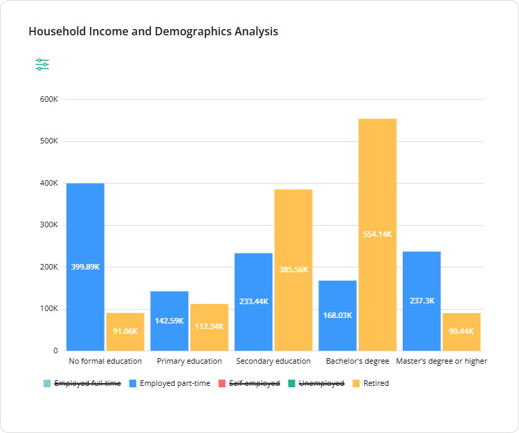

# Legend-Based Series Toggling

Legend-based series toggling is an interactive feature that allows users to show or hide individual data series in multi-series charts by clicking legend items. This is useful when charts display multiple series and users need to focus on specific data or reduce visual clutter.



[View Demo](/dashboard/examples/household-income-analysis-pivot-chart/ (linkStyle))

## Supported Visualization Types

- [Stacked Bar Chart](/dashboard/documentation/chart-types#stacked-bar-chart)
- [Pivot Chart](/dashboard/documentation/chart-types#pivot-chart)

## Configure the Legend

Series toggling is enabled by default and cannot be disabled. You can, however, change the legend position for better layout.

By default, the legend is displayed on the right. To reposition it, set the [`legendPosition`](/dashboard/documentation/api-reference/idashboardoptions#legendPosition) property to `"left"`, `"top"`, or `"bottom"`. You can apply this setting globally when creating a `Dashboard` instance or override it for individual items via the [`visualizer`](/dashboard/documentation/api-reference/idashboarditemoptions#visualizer) object:

```js
import { Dashboard } from "survey-analytics";

const dashboard = new Dashboard({
  questions: [ /* ... */ ],
  data: [ /* ... */ ],
  legendPosition: "bottom", // Apply globally
  items: [
    {
      name: "question1",
      type: "stackedbar",
      visualizer: {
        legendPosition: "right" // Override for this item
      }
    },
    // ...
  ]
});
```

## Other Interactive UI Features

- [Date Range Filtering](/dashboard/documentation/date-range-filtering)
- [Cross-Filtering](/dashboard/documentation/cross-filtering)
- [Sorting](/dashboard/documentation/sorting)
- [Visualization Type Selection](/dashboard/documentation/visualization-type-selection)
- [Dynamic Layout Management](/dashboard/documentation/dynamic-layout-management)