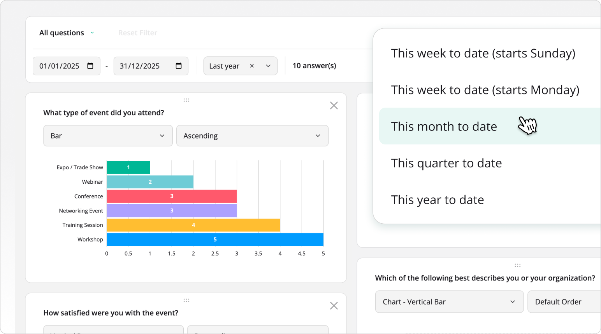

# SurveyJS Dashboard Overview

SurveyJS Dashboard is a JavaScript library for visualizing and analyzing survey and form data with interactive charts, tables, word clouds, and aggregated statistics.

It uses a SurveyJS JSON form definition together with an array of collected responses to identify question types and select suitable visualizations for the response data. The library is framework-independent and can be used in React, Angular, Vue, and plain JavaScript applications.

Use SurveyJS Dashboard to let users analyze collected form data through interactive charts and dashboards, identify trends, compare responses, and filter results directly in the browser.



## How SurveyJS Dashboard Works

SurveyJS Dashboard renders visualizations from two primary inputs:

1. A SurveyJS JSON form definition that describes the questions and their types.
2. An array of response objects containing the collected form data.

Dashboard uses the form definition to understand the structure of the data and selects appropriate visualizers for individual questions. You can use the default visualizations or configure which items appear, their order, chart types, and visualization settings.

A typical workflow is as follows:

1. Load a SurveyJS JSON form definition.
2. Load the corresponding response data from your backend or database.
3. Create a SurveyJS `Model` instance from the JSON form definition.
4. Pass the model's questions and the response data to Dashboard.
5. Render the dashboard in your application.
6. Allow users to filter, rearrange, and customize visualizations.

SurveyJS Dashboard does not provide data storage. You retain control over how survey definitions and response data are stored, retrieved, secured, and processed in your own infrastructure.

## Key Features

### Charts and Data Visualizations

- [Bar, Stacked bar, Pie, Doughnut, Histogram, Gauge, Bullet, and Radar (Spider) charts](/dashboard/documentation/chart-types)
- Pivot charts with configurable categories, multiple series, and aggregation
- Word clouds for free-text responses
- Text and statistics tables
- NPS visualizations
- Response counters
- Visualization support for Single- and Multi-Select Matrix, Dynamic Matrix, Dynamic Panel, and Composite question types

### Interactive Data Analysis

- Cross-filtering between dashboard visualizations
- Built-in date range filtering with predefined periods and custom ranges
- [Interactive chart-type switching](/dashboard/documentation/visualization-type-selection)
- Answer sorting and ordering
- Series toggling through chart legends
- Dynamic dashboard layouts with drag-and-drop reordering and resizing

### Dashboard Configuration

- Configure an entire dashboard declaratively with a single options object
- Select which questions and visualizations appear
- Set visualization types and per-item options
- Control display order
- Configure dashboard-wide settings such as legend position and date filtering
- Customize individual visualizers programmatically

### State Persistence

Changes users make while working with a dashboard&mdash;including visualization types, sorting, item visibility, and layout&mdash;can be captured as dashboard state.

You can save this state to your preferred storage and restore it later to provide persistent or user-specific dashboard configurations.

### Charting Engines

SurveyJS Dashboard supports two interchangeable charting engines:

- <a href="https://www.chartjs.org/" target="_blank">Chart.js</a>
- <a href="https://github.com/plotly/plotly.js#readme" target="blank">Plotly.js</a>

Chart.js is the default charting engine. You can select Plotly.js without changing the Dashboard API.

SurveyJS Dashboard also provides separate optional modules for:

- Dashboard UI and visualizers without a bundled charting engine
- Tabulator-based data tables
- Server-side MongoDB aggregation

### Localization and Accessibility

- [Localizable Dashboard UI](/dashboard/examples/localize-survey-data-dashboard-ui/documentation)
- Dashboard UI localization managed independently of the form locale
- Dashboard items exposed to assistive technologies as labelled groups
- ARIA roles and states for interactive controls
- Automated axe-core accessibility tests that include WCAG 2.1 AA and Section 508 rules

Explore the [Dashboard demos](/dashboard/examples/) to see available visualization types and interactive data-analysis features.

## Installation

Install SurveyJS Dashboard using npm:

```
npm install survey-analytics
```

Then follow the setup guide for your framework:

- [React](/dashboard/documentation/get-started-react)
- [Angular](/dashboard/documentation/get-started-angular)
- [Vue.js](/dashboard/documentation/get-started-vue)
- [Plain JavaScript](/dashboard/documentation/get-started-html-css-javascript)

## Package Architecture

SurveyJS Dashboard is framework-independent and renders directly into a DOM element.

The `survey-analytics` package provides the dashboard UI, visualization logic, filtering, layout management, and integration with supported charting engines.

It works with `survey-core` to interpret SurveyJS form questions and match collected response data to suitable visualizations.

Chart rendering is provided through an interchangeable chart adapter. Chart.js is used by default, while dedicated package entry points enable Plotly.js.

Additional optional modules provide data-table functionality and server-side aggregation for specialized scenarios.

## Releases and Updates

Visit the [Major Updates](/stay-updated/major-updates/2025-2026), [Release Notes](/stay-updated/release-notes), and [Roadmap](/stay-updated/roadmap) pages for recent features, fixes, and planned improvements.

## Licensing

SurveyJS Dashboard requires a commercial license for production use. A developer license is required for each software developer who works with the SurveyJS Dashboard APIs or implements its integration.

See [SurveyJS Licensing](/licensing) for licensing details.
