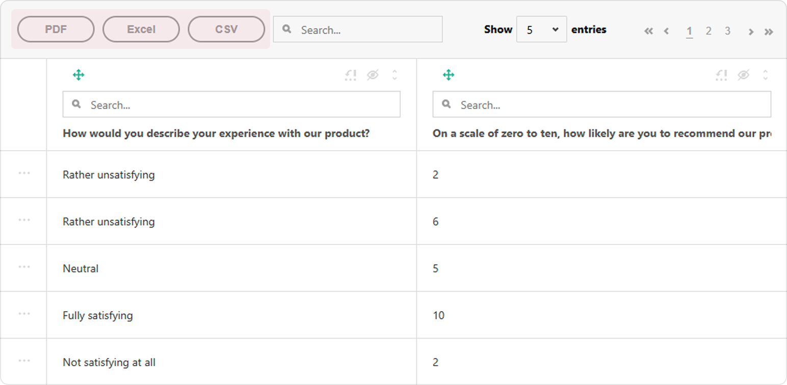

# Table View for Survey Results in a Vue.js Application

This step-by-step tutorial will help you set up a Table View for survey results using SurveyJS Dashboard in a Vue.js application. To add the Table View to your application, follow the steps below:

- [Install the `survey-analytics` npm Package](#install-the-survey-analytics-npm-package)
- [Configure Styles](#configure-styles)
- [Load Survey Results](#load-survey-results)
- [Render the Table](#render-the-table)
- [Enable Export to PDF and Excel](#enable-export-to-pdf-and-excel)

As a result, you will create the following view:

<details>
  <summary>View Live Example</summary>

<iframe src="/proxy/github/code-examples/dashboard-table-view/html-css-js/index.html"
    style="width:100%; border:0; border-radius: 4px; overflow:hidden;"
></iframe>

</details>

[View Full Code on GitHub](https://github.com/surveyjs/code-examples/tree/main/dashboard-table-view/vue3 (linkStyle))

If you are looking for a quick-start application that includes all SurveyJS components, refer to the following GitHub repository: <a href="https://github.com/surveyjs/surveyjs_vue3_quickstart" target="_blank">SurveyJS + Vue 3 Quickstart Template</a>.

## Install the `survey-analytics` npm Package

SurveyJS Dashboard is distributed as a <a href="https://www.npmjs.com/package/survey-analytics" target="_blank">survey-analytics</a> npm package. Run the following command to install it:

```sh
npm install survey-analytics --save
```

The Table View for SurveyJS Dashboard depends on the <a href="https://tabulator.info/" target="_blank">Tabulator</a> library. The command above automatically installs it as a dependency.

## Configure Styles

Import the Tabulator and Table View style sheets in the component that will render the Table View:

```html
<script setup lang="ts">
import 'tabulator-tables/dist/css/tabulator.css';
import 'survey-analytics/survey.analytics.tabulator.css';
</script>

<template>
  <!-- ... -->
</template>
```

## Load Survey Results

When a respondent completes a survey, a JSON object with their answers is passed to the `SurveyModel`'s [`onComplete`](https://surveyjs.io/form-library/documentation/api-reference/survey-data-model#onComplete) event handler. You should send this object to your server and store it with a specific survey ID (see [Handle Survey Completion](/form-library/documentation/get-started-react#handle-survey-completion)). A collection of such JSON objects is a data source for the Table View. This collection can be processed (sorted, filtered, paginated) on the server or on the client.

### Server-Side Data Processing

Server-side data processing enables the Table View to load survey results in small batches on demand and delegate sorting and filtering to the server. For this feature to work, the server must support these data operations. Refer to the following demo example on GitHub for information on how to configure the server and the client for this usage scenario:

[SurveyJS Dashboard: Table View - Server-Side Data Processing Demo Example](https://github.com/surveyjs/surveyjs-dashboard-table-view-nodejs-mongodb (linkStyle))

### Client-Side Data Processing

When data is processed on the client, the Table View loads the entire dataset at startup and applies sorting and filtering in a user's browser. This demands faster web connection and higher computing power but works smoother with small datasets.

To load survey results to the client, send the survey ID to your server and return an array of JSON objects with survey results:

```html
<script setup lang="ts">
// ...
import { onMounted } from "vue"

const SURVEY_ID = 1;

function loadSurveyResults (url) {
  return new Promise((resolve, reject) => {
    const request = new XMLHttpRequest();
    request.open('GET', url);
    request.setRequestHeader('Content-Type', 'application/x-www-form-urlencoded');
    request.onload = () => {
      const response = request.response ? JSON.parse(request.response) : [];
      resolve(response);
    }
    request.onerror = () => {
      reject(request.statusText);
    }
    request.send();
  });
}

onMounted(() => {
  loadSurveyResults("https://your-web-service.com/" + SURVEY_ID)
    .then((surveyResults) => {
      // ...
      // Configure and render the Table View here
      // Refer to the section below
      // ...
    });
});
</script>
```

For demonstration purposes, this tutorial uses predefined survey results. The following code shows a survey model and the structure of the survey results array:

```js
const surveyJson = {
  elements: [{
    name: "satisfaction-score",
    title: "How would you describe your experience with our product?",
    type: "radiogroup",
    choices: [
      { value: 5, text: "Fully satisfying" },
      { value: 4, text: "Generally satisfying" },
      { value: 3, text: "Neutral" },
      { value: 2, text: "Rather unsatisfying" },
      { value: 1, text: "Not satisfying at all" }
    ],
    isRequired: true
  }, {
    name: "nps-score",
    title: "On a scale of zero to ten, how likely are you to recommend our product to a friend or colleague?",
    type: "rating",
    rateMin: 0,
    rateMax: 10,
  }],
  completedHtml: "Thank you for your feedback!",
};

function randomIntFromInterval(min: number, max: number): number {
  return Math.floor(Math.random() * (max - min + 1) + min);
}
function generateData() {
  const data = [];
  for (let index = 0; index < 100; index++) {
    const satisfactionScore = randomIntFromInterval(1, 5);
    const npsScore = satisfactionScore > 3 ? randomIntFromInterval(7, 10) : randomIntFromInterval(1, 6);
    data.push({
      "satisfaction-score": satisfactionScore,
      "nps-score": npsScore
    });
  }
  return data;
}
```

## Render the Table

The Table View is rendered by the `Tabulator` component. Import this component and pass the survey model and results to its constructor to instantiate it. Assign the produced instance to a constant that will be used later to render the component:

```html
<script setup lang="ts">
// ...
// Stylesheets are imported here
// ...
import { Model } from 'survey-core';
import { Tabulator } from 'survey-analytics/survey.analytics.tabulator';

const surveyJson = { /* ... */ };
function generateData() { /* ... */ }

onMounted(() => {
  const survey = new Model(surveyJson);
  const surveyDataTable = new Tabulator(
    survey,
    generateData()
  );
});
</script>
```

Switch to the component template and add a page element that will serve as the Table View container. To render the Table View in the page element, call the `render(containerId)` method on the Tabulator instance you created previously:

```html
<script setup lang="ts">
// ...
onMounted(() => {
  // ...
  surveyDataTable.render("surveyDataTable");
});
</script>

<template>
  <div id="surveyDataTable" />
</template>
```

<details>
    <summary>View Full Code</summary>

```html
<script setup lang="ts">
import 'tabulator-tables/dist/css/tabulator.css';
import 'survey-analytics/survey.analytics.tabulator.css';
import { Model } from 'survey-core'
import { Tabulator } from 'survey-analytics/survey.analytics.tabulator'
import { onMounted } from "vue"

const surveyJson = {
  elements: [{
    name: "satisfaction-score",
    title: "How would you describe your experience with our product?",
    type: "radiogroup",
    choices: [
      { value: 5, text: "Fully satisfying" },
      { value: 4, text: "Generally satisfying" },
      { value: 3, text: "Neutral" },
      { value: 2, text: "Rather unsatisfying" },
      { value: 1, text: "Not satisfying at all" }
    ],
    isRequired: true
  }, {
    name: "nps-score",
    title: "On a scale of zero to ten, how likely are you to recommend our product to a friend or colleague?",
    type: "rating",
    rateMin: 0,
    rateMax: 10,
  }],
  completedHtml: "Thank you for your feedback!",
};

function randomIntFromInterval(min: number, max: number) {
  return Math.floor(Math.random() * (max - min + 1) + min);
}
function generateData() {
  const data = [];
  for (let index = 0; index < 100; index++) {
    const satisfactionScore = randomIntFromInterval(1, 5);
    const npsScore = satisfactionScore > 3 ? randomIntFromInterval(7, 10) : randomIntFromInterval(1, 6);
    data.push({
      "satisfaction-score": satisfactionScore,
      "nps-score": npsScore
    });
  }
  return data;
}

onMounted(() => {
  const survey = new Model(surveyJson);
  const surveyDataTable = new Tabulator(
    survey,
    generateData()
  );
  surveyDataTable.render("surveyDataTable");
});
</script>

<template>
  <div id="surveyDataTable" />
</template>

</script>
```
</details>

## Activate a SurveyJS License

SurveyJS Dashboard is not available for free commercial use. To integrate it into your application, you must purchase a [commercial license](https://surveyjs.io/licensing) for the software developer(s) who will be working with the Dashboard APIs and implementing the integration. If you use SurveyJS Dashboard without a license, an alert banner will appear at the top of the Table View interface:


After purchasing a license, follow the steps below to activate it and remove the alert banner:

1. [Log in](https://surveyjs.io/login) to the SurveyJS website using your email address and password. If you've forgotten your password, [request a reset](https://surveyjs.io/reset-password) and check your inbox for the reset link.
2. Open the following page: [How to Remove the Alert Banner](https://surveyjs.io/remove-alert-banner). You can also access it by clicking **Set up your license key** in the alert banner itself.
3. Follow the instructions on that page.

Once you've completed the setup correctly, the alert banner will no longer appear.

## Enable Export to PDF and Excel

The Table View for SurveyJS Dashboard allows users to save survey results as CSV, PDF, and XLSX documents. Export to CSV is supported out of the box. For export to PDF and XLSX, Table View needs the following third-party libraries:

- <a href="https://github.com/parallax/jsPDF#readme" target="_blank">jsPDF</a> - 2.4.0 or later
- <a href="https://github.com/JonatanPe/jsPDF-AutoTable#readme" target="_blank">jsPDF-AutoTable</a> - 3.5.20 or later
- <a href="https://sheetjs.com/" target="_blank">SheetJS</a> - 0.18.5 or later

Run the following commands to install them:

```sh
npm i jspdf@2.4.0 --save
npm i jspdf-autotable@3.5.20 --save
npm i xlsx@0.18.5 --save
```

> Review the third-party components' licenses to ensure that your project complies with the terms and conditions.

To enable export to PDF and Excel, import a jsPDF instance and apply the jsPDF-AutoTable plugin to it, then import SheetJS, and pass both the jsPDF and SheetJS instances to the `Tabulator` constructor:

```html
<script setup lang="ts">
// ...
import jsPDF from "jspdf";
import { applyPlugin } from "jspdf-autotable";
applyPlugin(jsPDF);

import * as XLSX from "xlsx";

const surveyJson = { /* ... */ };
function generateData() { /* ... */ }

onMounted(() => {
  const survey = new Model(surveyJson);
  const surveyDataTable = new Tabulator(
    survey,
    generateData(),
    { jspdf: jsPDF, xlsx: XLSX }
  );
  surveyDataTable.render("surveyDataTable");
});
</script>
```

> With [server-side data processing](#server-side-data-processing), exported documents contain only currently loaded data records. To export full datasets, you need to generate the documents on the server.

To view the application, run `npm run dev` in a command line and open [http://localhost:5173/](http://localhost:5173/) in your browser. If you do everything correctly, you should see the following result:



[View Full Code on GitHub](https://github.com/surveyjs/code-examples/tree/main/dashboard-table-view/vue3 (linkStyle))

## See Also

[Table View Demo Example](/dashboard/examples/export-survey-results-to-csv-files/ (linkStyle))