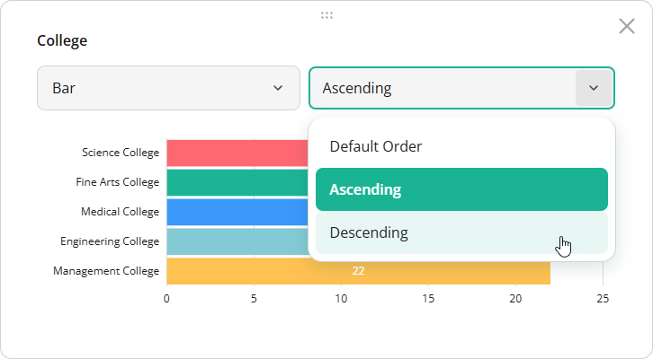

# Data Sorting in SurveyJS Dashboard

Sorting is an interactive feature that allows users to reorder answers based on response count, either in ascending or descending order.



By default, answers are displayed in the order defined in the survey JSON schema.

[View Demo](/dashboard/examples/student-feedback-survey-analysis/ (linkStyle))

## Supported Visualization Types

Sorting is available for the following visualization types:

- [Bar Chart](/dashboard/documentation/chart-types#bar-chart)
- [Statistics Table](/dashboard/documentation/chart-types#statistics-table)

## Enable or Disable Sorting

Sorting is enabled by default. To disable it for the entire dashboard, set the [`allowSortAnswers`](/dashboard/documentation/api-reference/idashboardoptions#allowSortAnswers) property to `false` when creating a `Dashboard` instance:

```js
import { Dashboard } from "survey-analytics";

const dashboard = new Dashboard({
  questions: [ /* Survey questions to visualize */ ],
  data: [ /* Survey responses to aggregate */ ],
  items: [ /* Dashboard item configurations */ ],
  allowSortAnswers: false // Disables sorting globally
});
```

To override this setting for a specific dashboard item, configure the `allowSortAnswers` property in its [`visualizer`](/dashboard/documentation/api-reference/idashboarditemoptions#visualizer) object. Item-level settings take precedence over the global configuration.

```js
import { Dashboard } from "survey-analytics";

const dashboard = new Dashboard({
  questions: [ /* ... */ ],
  data: [ /* ... */ ],
  allowSortAnswers: false, // Disable sorting globally
  items: [
    {
      name: "question1",
      visualizer: {
        allowSortAnswers: true // Re-enable sorting for this item
      }
    },
    // ...
  ]
});
```

## Apply Sorting Programmatically

To define a sort order in code, set the [`answersOrder`](/dashboard/documentation/api-reference/idashboardoptions#answersOrder) property to `"asc"` or `"desc"`. You can specify this property globally in the [`IDashboardOptions`](/dashboard/documentation/api-reference/idashboardoptions) configuration object or override it for individual dashboard items via the [`visualizer`](/dashboard/documentation/api-reference/idashboarditemoptions#visualizer) object. Item-level settings take precedence.

```js
import { Dashboard } from "survey-analytics";

const dashboard = new Dashboard({
  questions: [ /* ... */ ],
  data: [ /* ... */ ],
  answersOrder: "asc", // Apply ascending sort globally
  items: [
    {
      name: "question1",
      visualizer: {
        answersOrder: "desc" // Override with descending sort for this item
      }
    },
    // ...
  ]
});
```

## Other Interactive UI Features

- [Date Range Filtering](/dashboard/documentation/date-range-filtering)
- [Cross-Filtering](/dashboard/documentation/cross-filtering)
- [Visualization Type Selection](/dashboard/documentation/visualization-type-selection)
- [Legend-Based Series Toggling](/dashboard/documentation/legend-based-series-toggling)
- [Dynamic Layout Management](/dashboard/documentation/dynamic-layout-management)