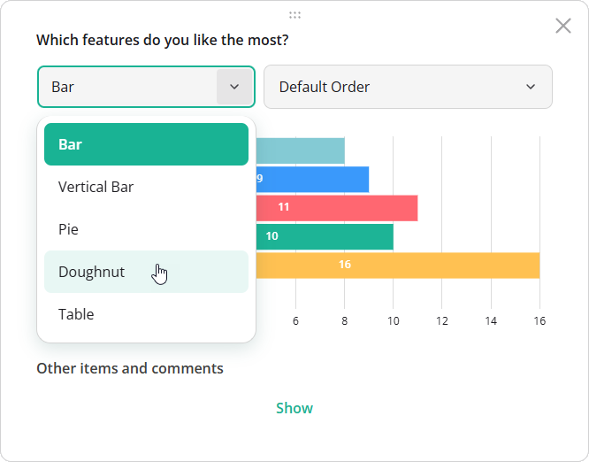

# Visualization Type Selection in SurveyJS Dashboard

Visualization type selection is an interactive feature that allows users to switch between different visualization types (charts, tables, and others) for each dashboard item using a dropdown menu.



[View Demo](/dashboard/examples/customer-satisfaction-survey-analysis/ (linkStyle))

## Supported Visualization Types

Visualization type selection is available for all types except [Response Count](/dashboard/documentation/chart-types#response-count).

## Enable or Disable Visualization Type Selection

Visualization type selection is enabled by default. To disable it for the entire dashboard, set the [`allowChangeVisualizerType`](/dashboard/documentation/api-reference/idashboardoptions#allowChangeVisualizerType) property to `false` when creating a `Dashboard` instance:

```js
import { Dashboard } from "survey-analytics";

const dashboard = new Dashboard({
  questions: [ /* Survey questions to visualize */ ],
  data: [ /* Survey responses to aggregate */ ],
  items: [ /* Dashboard item configurations */ ],
  allowChangeVisualizerType: false // Disables visualization type selection globally
});
```

To override this setting for a specific dashboard item, set its [`allowChangeType`](/dashboard/documentation/api-reference/idashboarditemoptions#allowChangeType) property. Item-level settings take precedence over the global configuration.

```js
import { Dashboard } from "survey-analytics";

const dashboard = new Dashboard({
  questions: [ /* ... */ ],
  data: [ /* ... */ ],
  allowChangeVisualizerType: false, // Disable globally
  items: [
    {
      name: "question1",
      allowChangeType: true // Re-enable for this item
    },
    // ...
  ]
});
```

## Change Visualization Type Programmatically

To define visualization types in code, set the [`type`](/dashboard/documentation/api-reference/idashboarditemoptions#type) property when configuring dashboard items:

```js
import { Dashboard } from "survey-analytics";

const dashboard = new Dashboard({
  questions: [ /* Survey questions to visualize */ ],
  data: [ /* Survey responses to aggregate */ ],
  items: [
    {
      name: "question1",
      type: "bar"
    },
    {
      name: "question2",
      type: "pie"
    },
    {
      name: "question3",
      type: "nps"
    }
  ]
});
```

You can also change the visualization type at runtime. The target type must be included in the [`availableTypes`](/dashboard/documentation/api-reference/idashboarditemoptions#availableTypes) array for the item. This means it should either be enabled by default (when [items are auto-generated](/dashboard/documentation/get-started-react#auto-generate-dashboard-items)) or explicitly listed in `availableTypes` (when you [configure dashboard items manually](/dashboard/documentation/get-started-react#configure-dashboard-items-manually)).

```js
import { Dashboard } from "survey-analytics";

const dashboard = new Dashboard({
  /* Dashboard configuration */
});

dashboard.getItem("question1").type = "doughnut";
```

## Restrict Available Types

Use the [`availableTypes`](/dashboard/documentation/api-reference/idashboarditemoptions#availableTypes) array to control which visualization types users can select:

```js
import { Dashboard } from "survey-analytics";

const dashboard = new Dashboard({
  questions: [ /* Survey questions to visualize */ ],
  data: [ /* Survey responses to aggregate */ ],
  items: [
    {
      name: "question1",
      type: "vbar",
      availableTypes: [ "vbar", "pie" ]
    },
    // ...
  ]
});
```

## Other Interactive UI Features

- [Date Range Filtering](/dashboard/documentation/date-range-filtering)
- [Cross-Filtering](/dashboard/documentation/cross-filtering)
- [Sorting](/dashboard/documentation/sorting)
- [Legend-Based Series Toggling](/dashboard/documentation/legend-based-series-toggling)
- [Dynamic Layout Management](/dashboard/documentation/dynamic-layout-management)